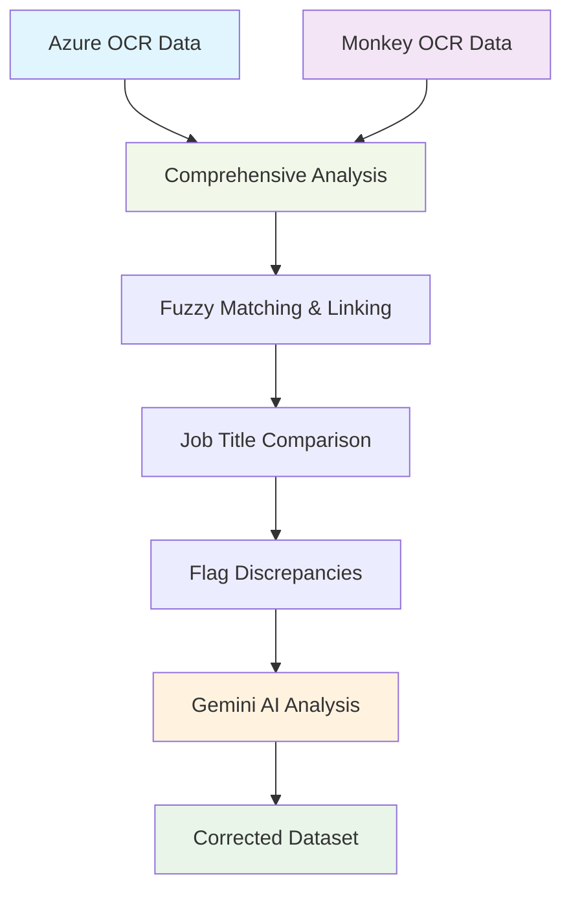

# MonkeyOCR Validation Tools

Production-ready tools for analyzing and correcting OCR data from Norwegian biographical texts.

## 🎯 Purpose

Compare Azure OCR and Monkey OCR results, identify discrepancies, and use AI to create the most accurate dataset.

## 📊 Workflow Overview



## 🛠️ Core Tools

| Tool | Purpose | Input | Output |
|------|---------|-------|--------|
| `comprehensive_json_extraction.py` | Main analysis engine | CSV files | Merged comparison data |
| `gemini_job_resolver.py` | AI-powered correction | Flagged records | Corrected job data |
| `run_gemini_batch_analysis.py` | Batch processing | Large datasets | Analysis results |
| `analyze_gemini_results.py` | Results analysis | Gemini output | Summary reports |

## 🚀 Quick Start

### 1. Basic Analysis (5 minutes)

```bash
# Test with 5 records
python gemini_job_resolver.py --max-records 5 --output-dir test_run
```

### 2. Full Analysis Pipeline

```bash
# Step 1: Generate comparison data
python comprehensive_json_extraction.py

# Step 2: AI-powered correction
python gemini_job_resolver.py --output-dir production_run --create-corrections

# Step 3: Analyze results
python analyze_gemini_results.py
```

## 📁 Data Flow

```text
Input Data:
├── Azure OCR CSV (d:\data\HCNC\norway\biographies\storage\AzureOCR\...)
├── Monkey OCR CSV (d:\data\HCNC\norway\biographies\storage\MonkeyOCR\...)

Processing:
├── comprehensive_comparison_dataframe.csv ← Merged & linked data
├── flagged_job_overlap_records.csv ← Records needing review

AI Analysis:
├── gemini_analysis_complete/ ← Individual JSON analyses
├── gemini_job_analysis_summary.csv ← Summary results

Final Output:
├── azure_corrected.csv ← Corrected Azure data
├── monkey_corrected.csv ← Corrected Monkey data
├── unified_best_of_both.csv ← Combined best results
└── corrections_summary.csv ← What was changed
```

## 🎯 Key Features

- **Fuzzy Matching**: Links records across OCR systems despite name variations
- **Job Overlap Analysis**: Computes similarity between job titles
- **AI Correction**: Uses Google Gemini-2.5-Flash to resolve discrepancies
- **Quality Tracking**: Rates Azure vs Monkey accuracy for each record
- **Correction Metadata**: Tracks all changes with timestamps and reasoning

## 📊 Example Results

- **Total Records**: 1,500+ biographical entries
- **Flagged for Review**: ~200 records with job title discrepancies
- **AI Success Rate**: 95%+ successful corrections
- **Quality Improvement**: Combines best elements from both OCR systems

## 🔧 Configuration

All scripts use command-line arguments:

```bash
python gemini_job_resolver.py --help
```

API keys managed via:

- KeyVault (production)
- Environment variables (development)

---

**Status**: Production Ready ✅
